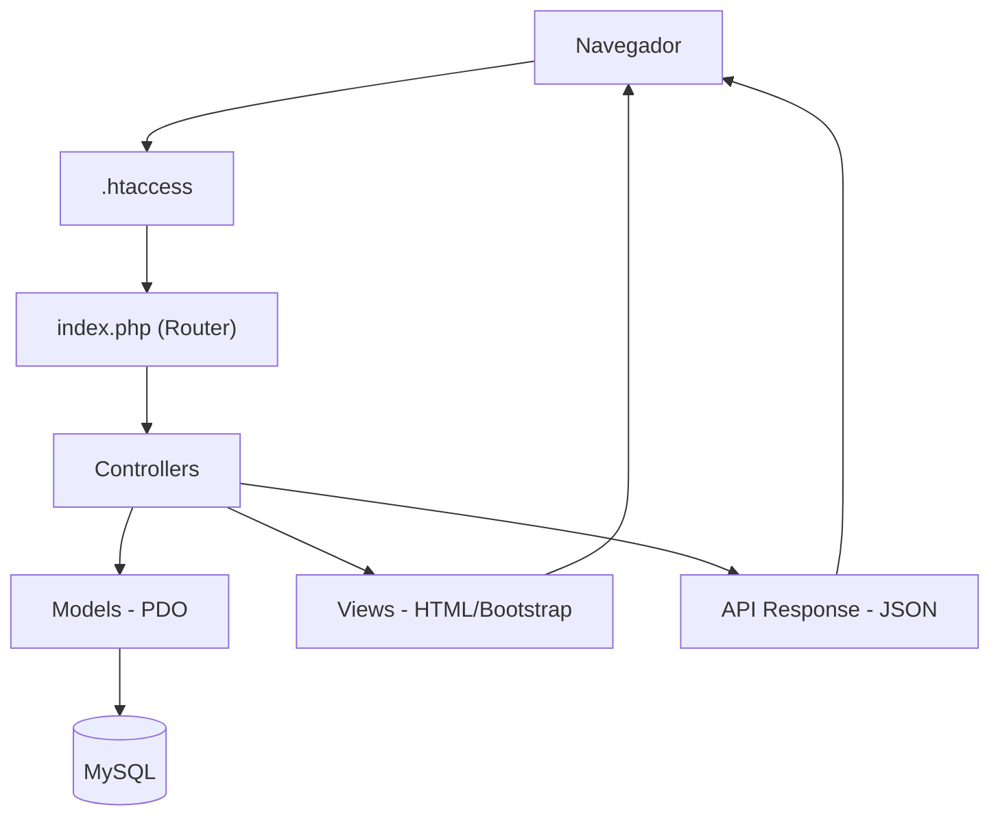

# Sistema MVC PHP – Tienda Profesional

Proyecto académico avanzado en PHP que implementa un sistema de catálogo y administración de productos bajo el patrón **MVC**, utilizando **POO** y **PDO** con transacciones. El sistema destaca por su enfoque en seguridad, URLs amigables y una interfaz profesional moderna.

## ✅ Funcionalidades Principales
1.  **Catálogo Público Moderno**: Diseño de tarjetas verticales con jerarquía visual, búsqueda dinámica y badges de precio/stock.
2.  **API REST Profesional**: Endpoints en formato JSON para consulta de productos, búsqueda y detalles por ID, cumpliendo estándares académicos de 2026.
3.  **Panel de Administración**: CRUD completo con validaciones de negocio (precios, stock, SKU único) y gestión de imágenes.
4.  **URLs Amigables (SEO)**: Navegación limpia mediante `.htaccess` (ej. `/catalogo/page/1` en lugar de parámetros feos).
5.  **Seguridad Robusta**: 
    - Protección contra ataques **CSRF** con tokens de sesión.
    - Prevención de **Inyección SQL** mediante sentencias preparadas (PDO).
    - Validación estricta de archivos (imágenes).
6.  **Bitácora de Acciones**: Registro detallado de cada movimiento administrativo (Login, Logout, CRUD) para auditoría.

## 🧱 Tecnologías
- **Backend**: PHP 8+ (MVC, POO, PDO, Namespaces, Autoload).
- **Base de Datos**: MySQL (Transacciones ACID).
- **Frontend**: Bootstrap 5.3, Google Fonts (Inter), Font Awesome 6.
- **Servidor**: Apache (mod_rewrite).

## 📂 Estructura del Proyecto
```
config/        # Conexión a BD y Autoload de clases.
controllers/   # Lógica de negocio y API (Auth, Producto, Public, ProductoApi).
models/        # Capa de datos (Usuario, Producto, Bitácora).
views/         # Interfaz de usuario y Layouts (Bootstrap 5).
uploads/       # Almacenamiento seguro de imágenes de productos.
index.php      # Enrutador (Router) principal.
.htaccess      # Configuración de URLs amigables.
```

## 🚀 Instalación y Ejecución
1.  **Base de Datos**: 
    - Crea una BD llamada `tienda_mvc`.
    - Ejecuta `databse.sql` para crear las tablas necesarias (usuarios, productos, bitacora).
2.  **Configuración**:
    - Ajusta tus credenciales en `config/Database.php`.
3.  **Ruta Base**: 
    - El proyecto detecta automáticamente la `BASE_URL`, asegúrate de tener activado el `mod_rewrite` en tu servidor (Laragon/XAMPP).
4.  **Usuario Admin**:
    - Genera un hash de contraseña con `passwd.php` e insértalo en la tabla `usuarios`.

## 🔗 Rutas Amigables
| Tipo | Ruta Amigable (Limpia) |
| :--- | :--- |
| **Público** | `/catalogo` |
| **Paginación** | `/catalogo/page/1` |
| **Login** | `/login` |
| **Admin** | `/productos` |
| **Admin Paginación** | `/productos/page/1` |
| **API JSON** | `/api/productos` |
| **API Detalle** | `/api/productos/5` |

## 🌐 API REST
La API responde estrictamente en formato JSON con la siguiente estructura:
```json
{
    "status": "success",
    "code": 200,
    "message": "Mensaje de confirmación",
    "data": { ... }
}
```
**Endpoints:**
- `GET /api/productos`: Lista completa de productos.
- `GET /api/productos?buscar=laptop`: Búsqueda de productos.
- `GET /api/productos/ID`: Detalle de un producto específico.

## 🔐 Seguridad y Bitácora
- **CSRF**: El sistema genera y valida tokens de sesión en cada petición POST.
- **Bitácora**: Se registra IP, User-Agent, Acción, Entidad afectada y Resultado para cada acción del administrador.

## 🧭 Diagrama de Funcionamiento


## 🎨 Paleta de Colores (Professional Slate)
- **Background**: `#f1f5f9` (Slate Light)
- **Navbar**: `#0f172a` (Deep Navy)
- **Primary**: `#334155` (Slate)
- **Success**: `#10b981` (Emerald)

---
*Proyecto desarrollado para la materia de Desarrollo Web Avanzado - UAS.*
